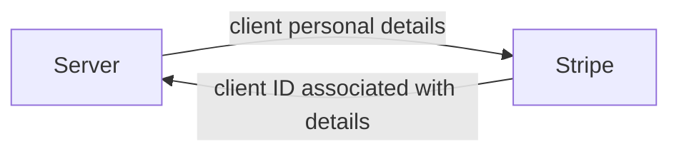
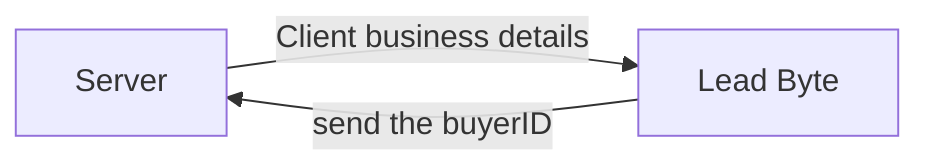
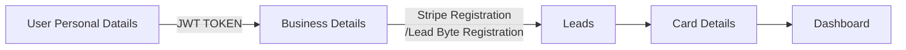
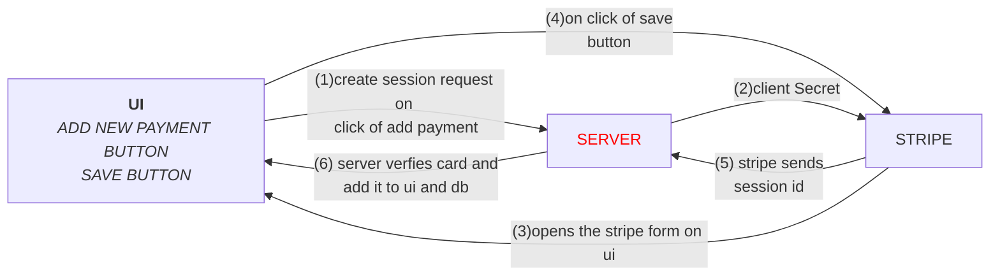
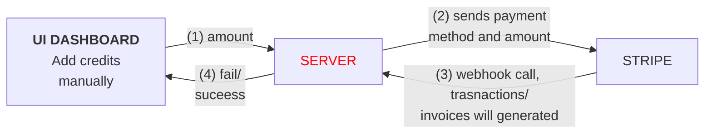
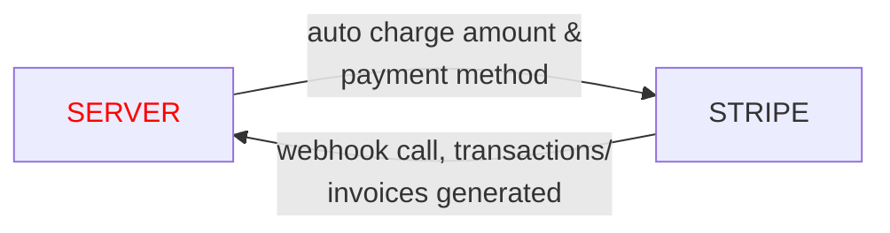
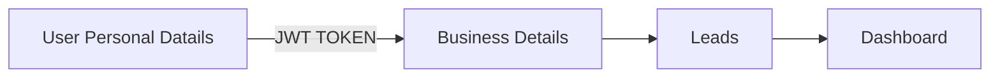
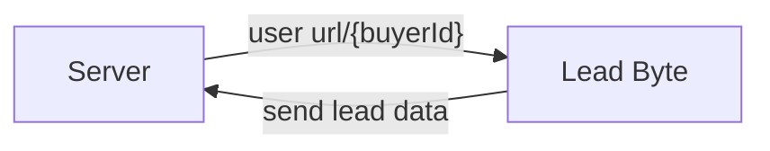

# Stripe Registration


# Lead Byte Registration



# Client Onboarding

### User Details
- Collect essential user information.
- Includes personal details, contact information, etc.

### Business Details
- Gather information related to the user's business.
- Business name, industry, and other relevant details

### Lead Details
- Capture lead-specific information for tracking purposes.
- Helps in understanding the client's potential needs.

### Card Details
- Securely record payment information for billing purposes.
- PCI-compliant handling of sensitive data.

### User Dashboard
- Access granted upon successful onboarding.
- Central hub for client interactions and management.



# Credits and Billing

### Payment Methods
- Allows users to add and manage payment methods.
- Primarily supports credit cards.

### Payment Processing Options
- Manually Buy: User-initiated payment.
- Auto Charges: Automated billing based on usage.
- Weekly Payment Requests: Scheduled weekly payments.

### Billing for Non-Billable Clients
- Disables credit and billing features for specific user types.
- Enhances flexibility for varied business models.

## Add payment method




## Add credits manually



## Autocharge



## Non-Billable Clients
- Non-billable clients complete onboarding without billing details.
- Access limited to non-financial features.





# Business Management
- Customizable lead costs, lead columns based on business industry.
- User with selected industry will get the leads based on their industry.


# XERO integration and Invoices
  
  ```mermaid
  graph LR 
        A[Server]--during onboarding step of\n business details sends business name-->
        B[XERO]--send the contact ID associated\n with unique business name-->A
  
  ```
  ## Invoice generation

  ```mermaid
  graph LR
  A[Server]--send details of amount,\n accountcode-->B
  B[Xero] --sends invoiceId -->A
  
  ```
  


# Lead Processing
- We create a unique URL of every user associated with Buyer Id.
- Then, we use that url in lead byte and send the json data to this URL
- In Backend, we store that data based on buyer id.



# Webhook Events
- Activity Logs - used to send updated data to given webhook URL.
- Business Details Submissions: send user's business and service details on creation and updation.
- CMS Buyer - send user's all details on onboarding to dashboard to CMS for creating buyer on spotdiff CMS.
- Event Expension - used to send user's specific details upon some events like 0 credits, top-up, updation of post codes.
- Fully Signup Non-Billable Clients - when non-billable user complete onboarding.
-  Fully Signup with credits - when user complete onboarding and their initial top-up.
-  lead details submission - used to send lead data.
-  lead reported - when lead's get reported.
-  lead reprocess - when lead's get reprocess.
-  send lead data - when user receives leads then the lead data also get triggered to their zapier URL.  