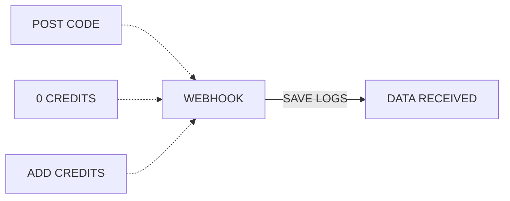
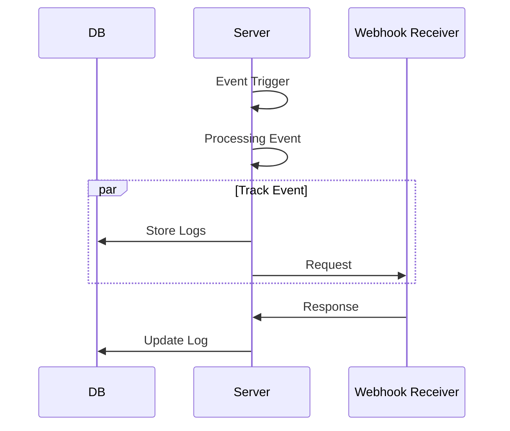

# Webhooks Events

To create a robust system which will allow the Admins to keep track of all the webhooks for all the important events within the system.

As right now we have three events, what we will do we will create a constant file in which we setup all the webhook URLs and define the events.




There are following Events the system will send webhooks out for

| Event Name | Event Code | Event Description | 
|----|----|----|
|User Credits 0|user_credits_zero| when the user lefts with zero or below lead cost credits|
|Post Code Change|post_code_change|when user updates their postcode|
|Add Credits| add_credits| When user top-ups |


### User Credits Zero
This event is triggered when the user lefts with zero or below lead cost credits

The data sent out to system is going to be as following:

```json
{
    buyerId: "0000",
    businessName: "test",
    postCodeList: ['AB', 'BN', 'GN'],
    remainingCredits: 0,
    eventCode: "user_credits_zero"
}
```

### Post Code Change
This event is triggered when user updates there postcode

The data sent out to system is going to be as following:

```json
{
    buyerId: "0000",
    businessName: "test",
    postCodeList: ['AB', 'BN', 'GN'],
    eventCode: "post_code_change"
}
```

### Add Credits
This event is triggered when user top-up their account

The data sent out to system is going to be as following:

```json
{
    buyerId: "0000",
    buyerName: "test",
    postCodeList: ['AB', 'BN', 'GN'],
    topUpAmount: 100,
    eventCode: "add_credits"
}
```


# Webhooks event logs



In above sequence diagram :

 ### Event Trigger: 
The sequence starts with an "Event Trigger" on the Server. This could represent any kind of event that initiates a process.

### Processing Event: 
After the event trigger, the Server engages in some processing labeled as "Processing Event." This could involve handling the initial event or preparing data for further actions.

### Parallel Execution (par - Track Event):
- The diagram then enters a parallel execution block labeled "Track Event."
- Two actions happen simultaneously:
    - ### Storing Logs in the Database (Server ->> DB: Store Logs):
      - The Server sends a request to the Database to store logs.
      - This action happens in parallel with the other action.
    - ### Request to Webhook Receiver (Server ->> Webhook Receiver: Request):
      - The Server sends a request to the Webhook Receiver. This could involve notifying the webhook receiver about the event or requesting additional information.

### Webhook Receiver Response:
- After the parallel execution block, the Webhook Receiver sends a response back to the Server 
- This response contain information related to the webhook request or an acknowledgment of the received request which is to be updated in event logs.

### Update Log in the Database:
- Following the response, the Server continues with an action which comes from webhook response to update logs in the Database 
- This step involve modifying or appending information to the logs based on the processed event.