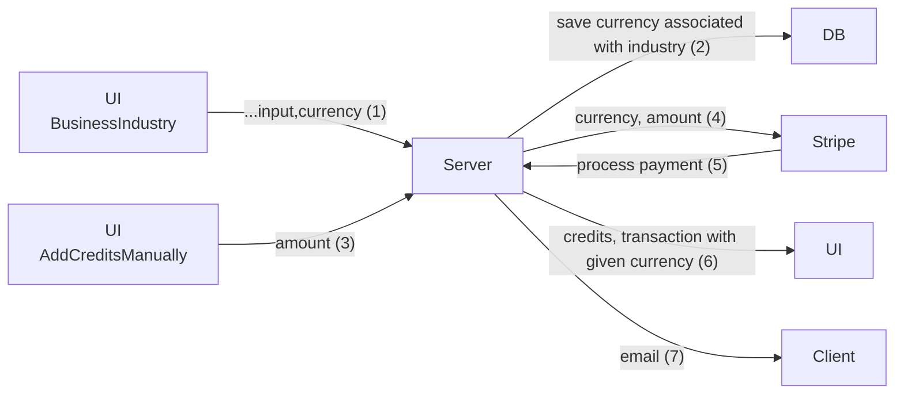

# Accept Euros/Dollars

1. While creating business industry, we will take currency input associated with leadCost.
2. Now, user signup with Industry.
3. While assigning the industry to user we will also assign the currency to the user.
4. Now, All top-ups, bills will work on the user's currency.
5. Admin can also change the currency of user.

