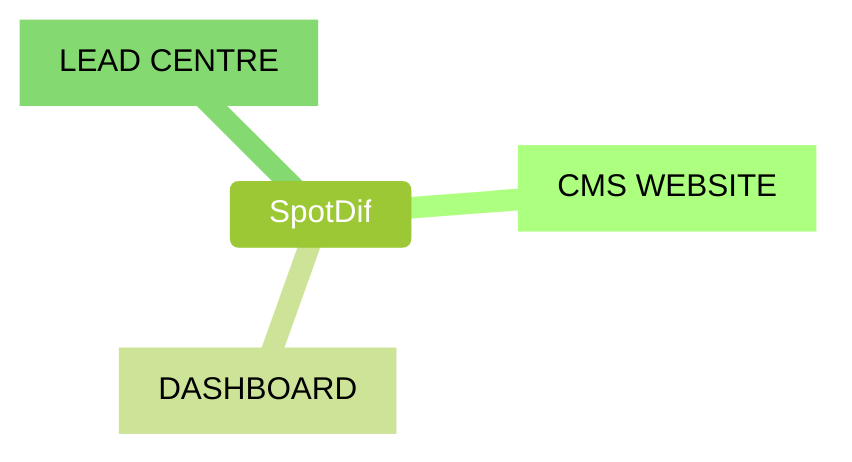
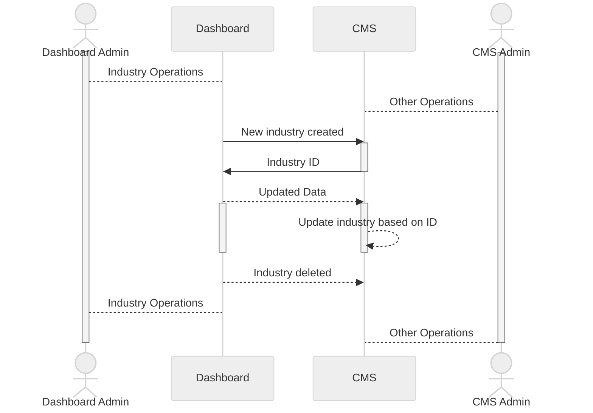
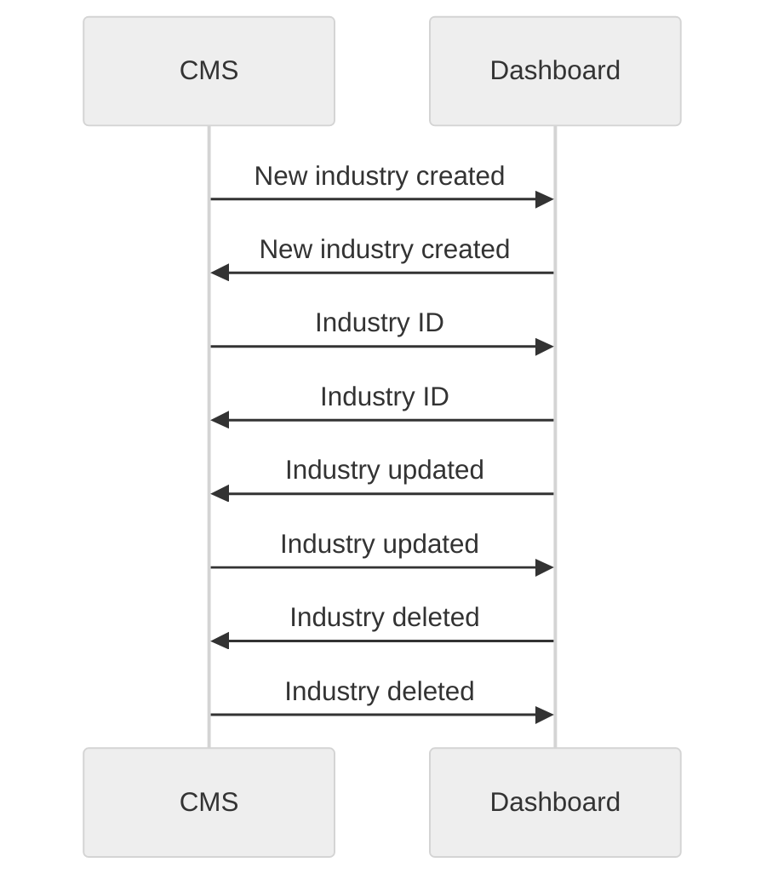

# Industry Sync
Since industry is one of the core points in all spotdif related systems we need to have a way to sync industry data between different systems. This is done by using the industry sync service. But in order to be effective about the sync, we need some central point and some rules to follow.

## Central point
Initially, the Payload CMS site seems to be good point but since we have Lead Centre relying on Dashboard for information and Payload CMS having rate limits and responsibility to be highly available at all times, we propose that Dashboard should be the central point for industry sync.

## Rules
1. Dashboard will have a new key for CMS called `cms_id`
2. This `cms_id` will actually be the ID of the industry in the CMS side
3. When a new industry is created in the Dashboard, it will be created in the CMS as well
4. CMS upon creating the industry will notify Dashboard of the ID
5. Dashboard will store this ID in the `cms_id` field
6. For earlier industries, we will have a manual process to sync the industries meaning add the ID to the `cms_id` field.
7. So that there is a link between systems.
   1. When an industry is updated in the Dashboard, the CMS will be notified of the update
   2. When an industry is updated in the CMS, the Dashboard will be notified of the update
   3. When an industry is deleted in the Dashboard, the CMS will be notified of the delete
   4. When an industry is deleted in the CMS, the Dashboard will be notified of the delete

## Option—A
Dashboard will send out information to CMS but not the other way around. This is because the Dashboard is the central point and the CMS is the secondary point. The Dashboard will be the source of truth for the industry data, and the fields that are not of use to Dashboard will not be synced.

## Option—B
Both systems keep their set of unique data and sync with each other only common fields. This is because both systems are equally important and have their own data.

